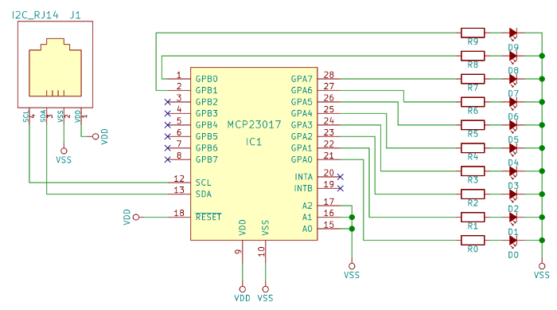

I2C LED Bar Graph
=================

[](pictures/bargraph.mov)

[](https://travis-ci.org/simlun/i2c-led-bar-graph)

An LED Bar Graph module controlled over an I2C bus. It's built from a 10 segment LED bar graph and an MCP23017 I/O expander. Squirrel code is provided here for controlling the device from an [Electric Imp][3].


Schematic
---------

The [KiCad](http://www.kicad-pcb.org/) source files can be found under `pcb/`. The schematic rendered as a PDF can also be found under `pcb/plots/`. The KiCad project depends on [my component library][4] which should be checked out alongside this repository.




Development
-----------

The software was developed test-first with the [SqJasmine][1] testing framework. Automatically running the tests on source code file save is an incredible productivity boost. Here's how to do this on a Mac:

```
$ brew install squirrel entr
$ libs/sqjasmine/scripts/autotest
```


[1]: http://github.com/simlun/sqjasmine
[2]: http://entrproject.org/
[3]: https://www.electricimp.com/
[4]: https://github.com/simlun/kicad-library-by-simlun
